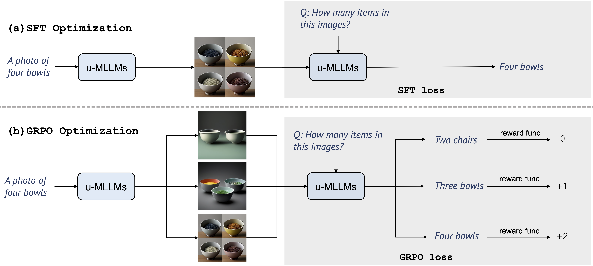

<div align="center">
<h3>UniRL: Self-Improving Unified Multimodal Models via Supervised and Reinforcement Learning</h3>

[Weijia Mao](https://scholar.google.com/citations?hl=zh-CN&user=S7bGBmkyNtEC&view_op=list_works&sortby=pubdate)<sup>1&#42;</sup>&nbsp;
[Zhenheng Yang](https://scholar.google.com/citations?user=Ds5wwRoAAAAJ&hl=en)<sup>2</sup>&nbsp;
[Mike Zheng Shou](https://sites.google.com/view/showlab)<sup>1</sup> 

<sup>1</sup> [Show Lab](https://sites.google.com/view/showlab/home?authuser=0), National University of Singapore&nbsp; <sup>2</sup> Bytedance&nbsp;



In this work, we introduce UniRL, a self-improving post-training approach. Our approach enables the model to generate images from prompts and use them as training data in each iteration, without relying on any external image data. Moreover, it enables the two tasks to enhance each other: the generated images are used for understanding, and the understanding results are used to supervise generation. We explore supervised fine-tuning (SFT) and Group Relative Policy Optimization (GRPO) to optimize the models. UniRL offers three key advantages: (1) it requires no external image data, as all training samples are generated by the model itself during training; (2) it not only improves individual task performance, but also reduces the imbalance between generation and understanding; and (3) it requires only several additional training steps during the post-training stage. We evaluate UniRL on top of Show-o and Janus, achieving a GenEval score of 0.77 for Show-o and 0.65 for Janus. 

</div>


<br/>

## TODO
- [X] Release the inference code.
- [ ] Release the training code.

## Hugging Face models

The Show-o checkpoints can be found on [Hugging Face](https://huggingface.co/benzweijia/UniRL):


## Getting Started
First, set up the environment:
```
pip3 install -r requirements.txt
```
Login your wandb account on your machine or server.
```
wandb login <your wandb keys>
```
Test GenEval benchmark for **Text to Image Generation** and you can view the results on wandb.
```
sh run_eval.sh
```

## Training pipeline
**Prepare your training data and change the data path in `configs/xx.yaml`.**

Note that, our training process is based on `accelerate`. Please ensure to config your `accelerate` for distributed training. We provide config examples below for (distributed) training on a single GPU or multiple GPUs.
```
├── accelerate_configs/ 
|   ├── multi_nodes (6x8 GPUs)
|   |   ├—— ...
|   ├── 1_gpu.yaml
|   └── 8_gpu_deepspeed_zero2.yaml
```


<!-- ### Citation
To cite the paper and model, please use the below:
```
@article{xie2024showo,
  title={Show-o: One Single Transformer to Unify Multimodal Understanding and Generation},
  author={Xie, Jinheng and Mao, Weijia and Bai, Zechen and Zhang, David Junhao and Wang, Weihao and Lin, Kevin Qinghong and Gu, Yuchao and Chen, Zhijie and Yang, Zhenheng and Shou, Mike Zheng},
  journal={arXiv preprint arXiv:2408.12528},
  year={2024}
}
``` -->
